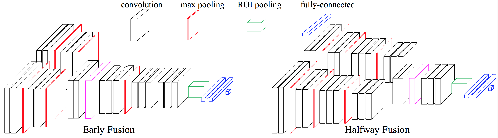
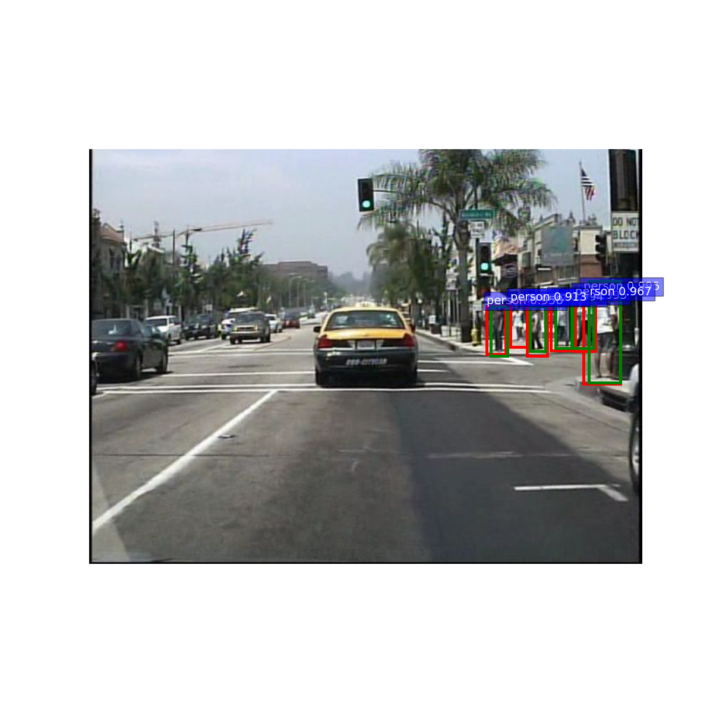
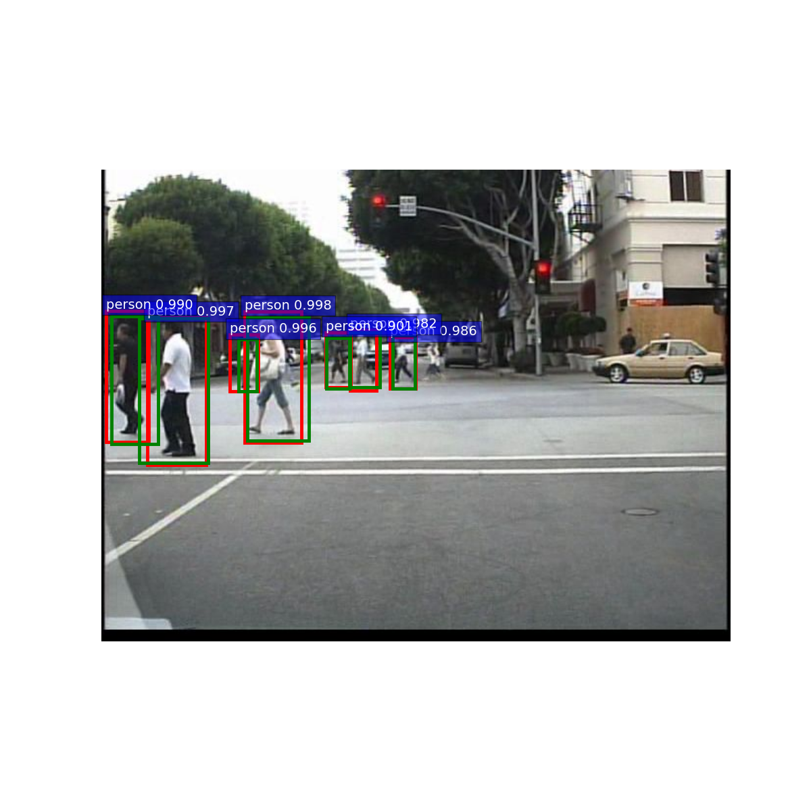
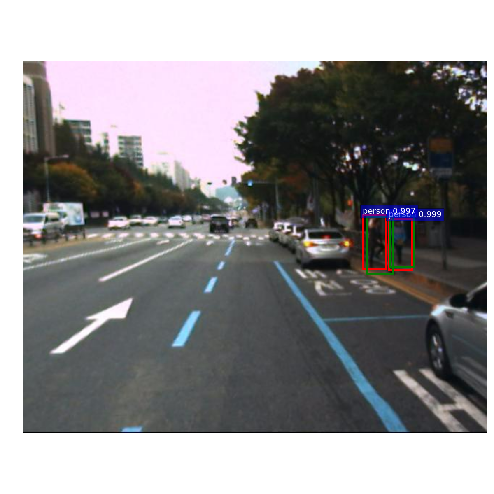
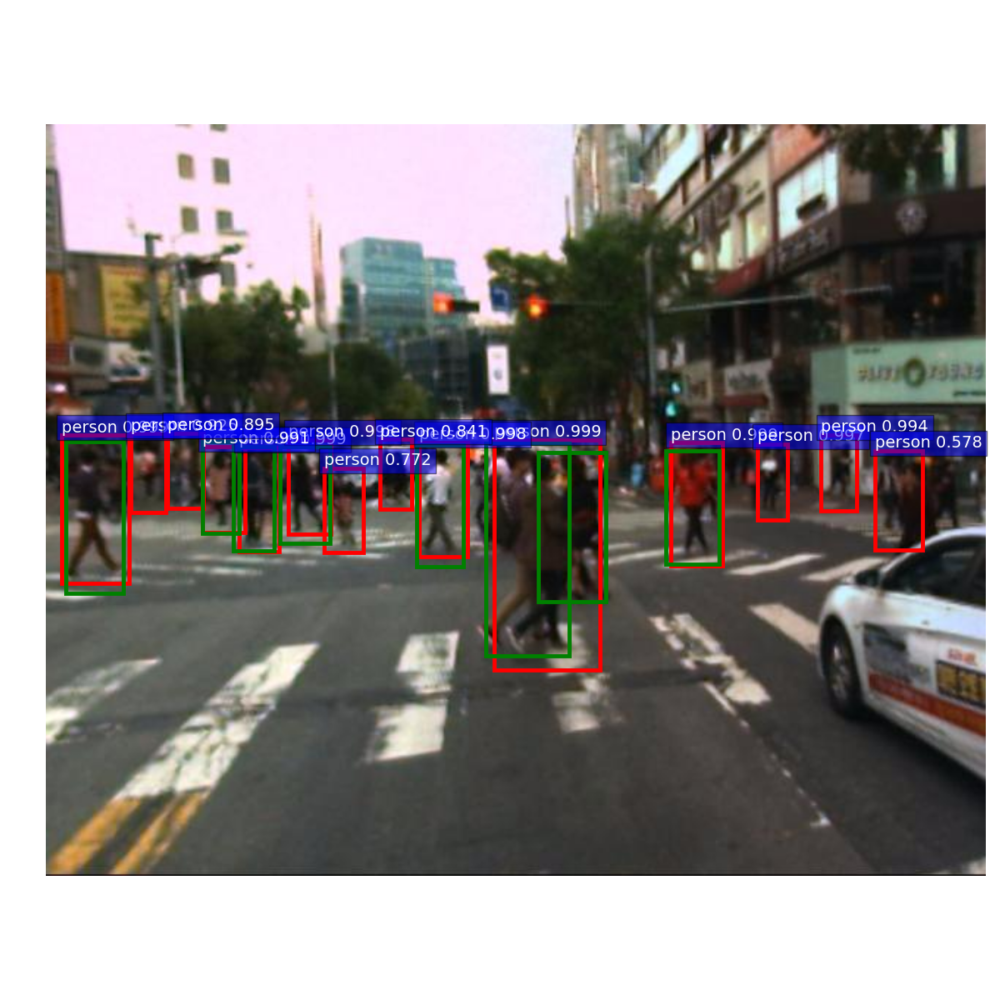

### Multispectral Deep Neural Networks for Pedestrian Detection
Editted by Jingjing Liu, Rutgers University.



Code used in reproducing results in our paper [Multispectral deep neural networks for pedestrian detection](http://paul.rutgers.edu/~jl1322/papers/BMVC16_liu.pdf) by Jingjing Liu, Shaoting Zhang, Shu Wang, and Dimitris N. Metaxas. BMVC 2016. [[project link]](http://paul.rutgers.edu/~jl1322/multispectral.htm).

This repository is a folk of py-faster-rcnn [offciel code](https://github.com/rbgirshick/py-faster-rcnn), written by Ross Girshick. For how to install the required softwares and set up the code in right configuration, e.g., Caffe, pycaffe, please refer to their original [README.md](https://github.com/rbgirshick/py-faster-rcnn/blob/master/README.md).

### Download pretrained models
[VGG16 model on caltech](https://drive.google.com/open?id=0ByrJI3mShdW6WVBxQldmdnE2S2s) trained on Caltech pedestrian dataset.

[VGG16 model on kaist (RGB input)](https://drive.google.com/open?id=0ByrJI3mShdW6LWNqT0tYQ3JteW8) trained on Kaist pedestrian dataset.

[VGG16 model on kaist (multispectral input)](https://drive.google.com/open?id=0ByrJI3mShdW6R3R1dkE4QlNQUUk) trained on Kaist multispectral dataset.

Save these models to `models/caltech/VGG16/`, `models/kaist/VGG16/`, and `models/kaist_fusion/VGG16/`, respectively.

### Run demos
Run `sh ./run_demo.sh caltech` for images from Caltech.

Run `sh ./run_demo.sh kaist-color` for images from Kaist.

Run `sh ./run_demo.sh kaist-fusion` for multispectral images from Kaist.

### Caltech results
 

### KAIST results
 

### License

Our code is released under the MIT License (refer to the LICENSE file for details).

### Citing our paper
If you find our work useful in your research, please consider citing:

```
@article{liu2016multispectral,
  title={Multispectral deep neural networks for pedestrian detection},
  author={Liu, Jingjing and Zhang, Shaoting and Wang, Shu and Metaxas, Dimitris N},
  journal={arXiv preprint arXiv:1611.02644},
  year={2016}
}
```
